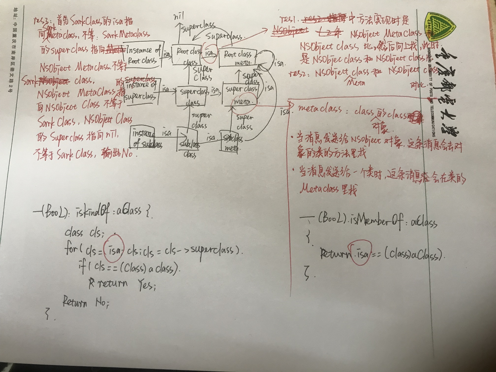

##level1
####(1) 下面的代码输出什么? 
>@implementation Son : Father
-(id)init 
{ 
self = [super init];
if (self) { 
 NSLog(@"%@", NSStringFromClass([self class]));
NSLog(@"%@", NSStringFromClass([super class]));
} 
return self;
} 
@end

输出都是son
因为管是self还是super真正调用的对象都是一样的，只是查找方法的位置不一样，self是从当前类结构中开始查找，super是从父类中查找，但方法真正的接受者都是当前类或者当前类的对象
当调用 ［self class] 时，实际先调用的是 objc_msgSend函数，第一个参数是 Son当前的这个实例，然后在 Son 这个类里面去找 - (Class)class这个方法，没有，去父类 Father里找，也没有，最后在 NSObject类中发现这个方法。而 - (Class)class的实现就是返回self的类别，故上述输出结果为 Son。
而当调用 [super class]时，会转换成objc_msgSendSuper函数。第一步先构造 objc_super 结构体，结构体第一个成员就是 self 。 第二个成员是 (id)class_getSuperclass(objc_getClass(“Son”)) , 实际该函数输出结果为 Father。 第二步是去 Father这个类里去找 - (Class)class，没有，然后去NSObject类去找，找到了。最后内部是使用 objc_msgSend(objc_super->receiver, @selector(class))去调用， 此时已经和[self class]调用相同了，故上述输出结果仍然返回 Son。

####(2) 下面的BOOL值分别是什么? 
>BOOL res1 = [(id)[NSObject class] isKindOfClass:[NSObject class]];
BOOL res2 = [(id)[NSObject class] isMemberOfClass:[NSObject class]];
BOOL res3 = [(id)[Sark class] isKindOfClass:[Sark class]];
BOOL res4 = [(id)[Sark class] isMemberOfClass:[Sark class]];

yes，no，no，no
-(BOOL) isKindOfClass: classObj判断是否是这个类或者这个类的子类的实例
-(BOOL) isMemberOfClass: classObj 判断是否是这个类的实例

####(3)下面的代码会?Compile Error / Runtime Crash / NSLog...? 

>@interface NSObject (Sark)
+(void)foo;
@end

>@implementation NSObject (Sark)

>-(void)foo
{
    NSLog(@"IMP: -[NSObject (Sark) foo]");
}
@end

>// 测试代码 

>[NSObject foo];

>[[NSObject new] foo];

[NSObject foo]： NSLog(@"IMP: -[NSObject (Sark) foo]")
[[NSObject new] foo]： NSLog(@"IMP: -[NSObject (Sark) foo]")

objc runtime加载后NSObject的Sark Category被加载，头文件+(void)foo没有IMP，只会出现一个warning。被加到Class的Method list里的方法只有-(void)foo，Meta Class的方法列表里没有。

执行[NSObject foo]时，会在Meta Class的Method list里找，找不着就继续往super class里找，NSObject Meta Clas的super class是NSObject本身，这时在NSObject的Method list里就有foo这个方法了，能够正常输出。

执行[[NSObject new] foo]就简单的多了，[NSObject new]生成一个实例，实例的Method list是有foo方法的，于是正常输出。